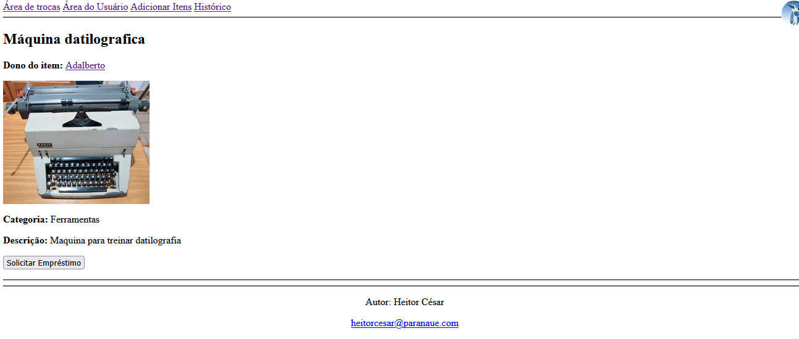
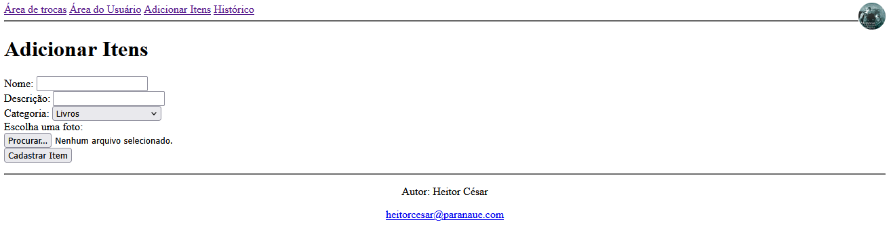

# LoanLink

## Descrição

O LoanLink é uma aplicação web desenvolvida em PHP e MySQL para facilitar o empréstimo de itens entre usuários. A plataforma permite cadastrar itens, solicitar empréstimos, aprovar ou recusar solicitações, registrar devoluções e acompanhar o histórico de todas as transações.

## Objetivo

Este projeto foi desenvolvido com o objetivo de praticar o desenvolvimento Full Stack utilizando PHP e MySQL, implementando autenticação, CRUD, upload de imagens, sessões, relacionamentos entre tabelas e regras de negócio.

## Lógica

1. O usuário cria uma conta informando nome, e-mail, telefone, senha e uma foto de perfil, ou realiza login caso já possua cadastro.
2. Ao acessar o dashboard o usuário pode cadastrar novos itens, editar, deletar e/ou postar os já existentes.
3. Na página principal, é possível visualizar os itens publicados por outros usuários e solicitar seu empréstimo.
4. O proprietário do item recebe a solicitação e pode aceitá-la ou recusá-la. Caso aceite, o empréstimo é registrado e o solicitante recebe um prazo de sete dias para devolução.
5. Após a devolução, o item volta a ficar disponível para novos empréstimos, e a data real de devolução é registrada no histórico.

## Funcionalidades

- Cadastro de usuários
- Login
- Dashboard
- Cadastro de itens
- Edição de itens
- Exclusão de itens
- Perfil de usuários
- Solicitação de empréstimos
- Aprovação de solicitações
- Recusa de solicitações
- Registro de devoluções
- Histórico de empréstimos

## Tecnologias

### Utilizadas

- PHP
- MySQL
- HTML5
- CSS3
- Git
- GitHub

### Planejadas

- React
- Tailwind CSS

## Demonstração

### Login/Cadastro: 

Login: 


Cadastro: 


### Dashboard: 


### Página Principal: 



### Adicionar Itens: 



### Editar Itens: 


## Como executar o projeto

### Pré-requisitos

- PHP 8+
- MySQL
- Laragon ou XAMPP
- Git
### Instalação

1. Clone este repositório

```bash
git clone https://github.com/heitorcfcazella-prog/loanlink.git
```

2. Crie um banco de dados chamado

```
loanlinkdb
```

3. Importe o arquivo

```
database/loanlink.sql
```

4. Copie

```
includes/db.example.php
```

para

```
includes/db.php
```

5. Configure as credenciais do banco.

6. Inicie o servidor (Laragon ou XAMPP).

7. Acesse

```
http://localhost/loanlink
```

## Melhorias Futuras

- Interface em React
- Tailwind CSS
- Busca e filtros
- Botão de seguir
- Notificações
- Algoritmo baseado em likes